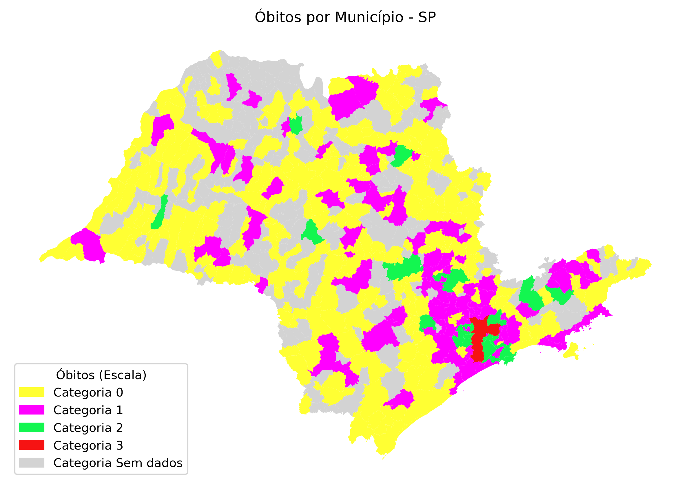
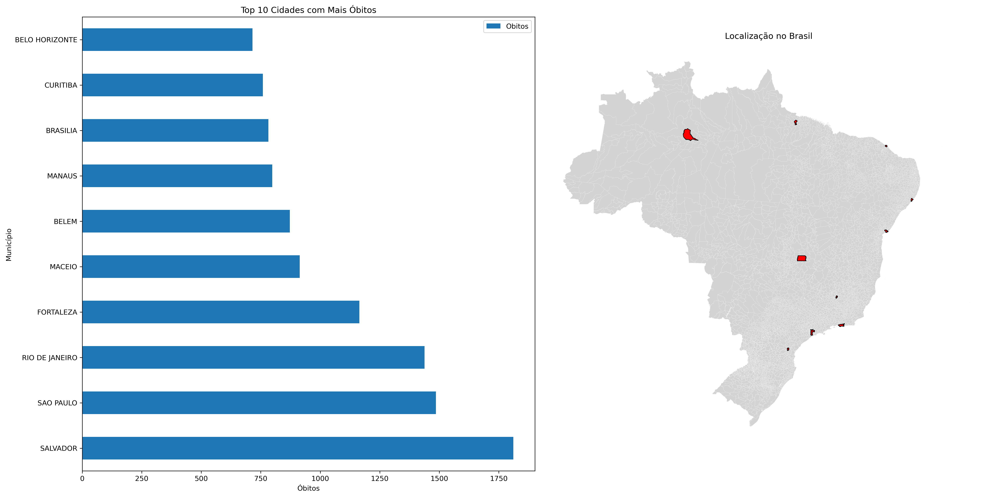

# Análise do Número de Homicídios através de Índices Socioeconômicos no Brasil

## 📊 Sobre o Projeto
Este projeto analisa dados do Censo de 2010 para investigar a correlação entre taxas de homicídios (dados do SIM - Sistema de Informações sobre Mortalidade) e índices socioeconômicos como taxa de desemprego, PIB e densidade populacional no Brasil. 

O objetivo é interpretar esses dados de forma aprofundada, compreendendo como essas relações se distribuem de acordo com as regiões do país e oferecendo uma visão mais clara das dinâmicas sociais que impactam a violência.

## 🛠️ Tecnologias e Ferramentas Utilizadas
* **Linguagem:** Python
* **Manipulação de Dados:** Pandas, NumPy
* **Análise Geoespacial:** GeoPandas
* **Estatística e Regressão:** Statsmodels, SciPy
* **Visualização:** Matplotlib, Seaborn, IPyWidgets

## 📈 Exemplos de Análises

Abaixo podemos ver a distribuição de óbitos no estado de São Paulo:



Abaixo podemos ver o top 10 de municípios com mais óbitos


## 🚀 Como executar o projeto
1. Clone este repositório:
   ```bash
   git clone [https://github.com/gustavocsales/Analise-Homicidios-PANDAS.git](https://github.com/gustavocsales/Analise-Homicidios-PANDAS.git)
